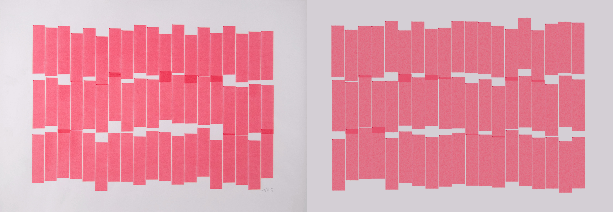

# MAS.S62 Recreating the Past

This repository contains all the OpenFrameworks and p5js applications to recreate pieces for each different artist seen in class.

## Vera Molnár

[Vera Molnár](https://en.wikipedia.org/wiki/Vera_Moln%C3%A1r) is a Hungarian media artist, widely considered to be a pioneer of computer art and generative art.

## John Whitney

[John Whitney](https://en.wikipedia.org/wiki/John_Whitney_(animator)) was an American animator, composer and inventor, widely considered to be one of the fathers of computer animation.

## Muriel Cooper

[Muriel Cooper](https://en.wikipedia.org/wiki/Muriel_Cooper) was a pioneering book designer, digital designer, researcher, and educator, and a co-founder of the MIT Media Lab.

